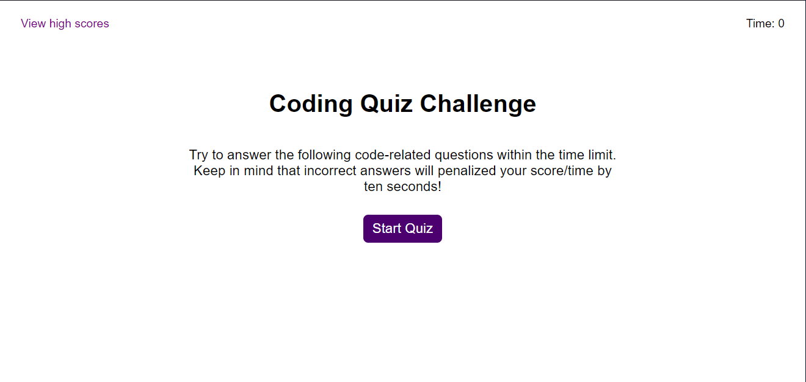
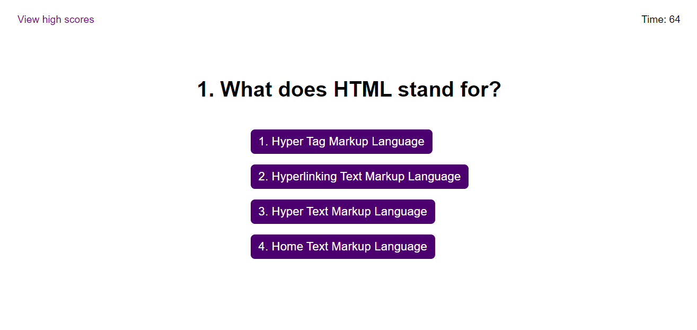
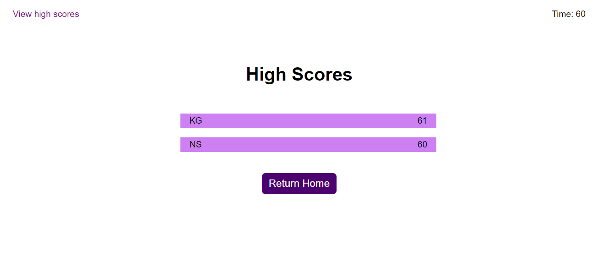

# Coding Quiz

## Test your front end development knowledge with this coding quiz web application!    

### This application, developed as a challenge for the Rutgers Coding Bootcamp,  makes use of JavaScript DOM Manipulation and setInterval / setTimeout functions.    

  
Preview of the home screen    

  
Preview of one of the quiz' questions    

  
Preview of the quiz' high score screen  

### Saves your high scores across multiple browser sessions with the use of localStorage. Challenge your friends to get the best time!    

Built with HTML, CSS, and JavaScript